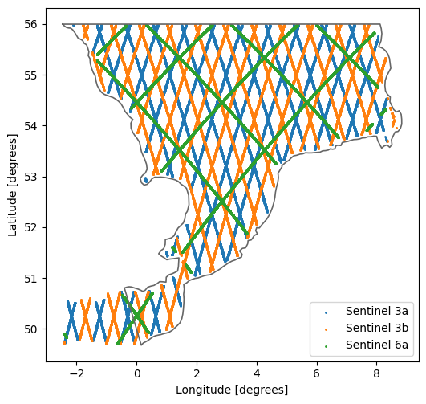
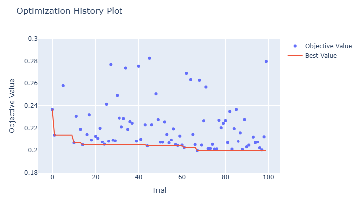

# Autocalibration of a MIKE FM Southern North Sea model

This repository presents a workflow for the automatic calibration of a MIKE 21 model. Specifically, it focuses on calibrating the Manning (Strickler) roughness coefficient by minimizing the Root Mean Square Error (RMSE) of the simulated water levels. For calibration, the model is compared against satellite altimetry observations of the Sentinel mission.

> ⚠️ **Important Disclaimer**  
> This model setup is a **highly simplified version** of a hindcast model developed by DHI. The mesh has been reduced from over **150,000** to approximately **8,000 elements**, and input data is coarser in both time and space. As a result, model accuracy is lower — e.g., typical RMSE for water levels increases from ~8 cm to **15–20 cm**.  
>  
> This model is **not calibrated** for operational use. It is intended for **educational and research purposes only**, and the results **must not** be used for decision-making. The performance shown here does **not** reflect that of DHI’s high-resolution models.

## Steps

The workflow is divided and documented in the following notebooks:
- [1-Overview](notebooks/1-overview.ipynb): Gives an overview of the model, the observations and the calibration parameters.
- [2-Calibration](notebooks/2-calibration.ipynb): Performs the calibration of the model.
- [3-Analysis](notebooks/3-analysis.ipynb): Gives an overview of the results of the calibration with help of modelskill.

The calibration is based on the following libraries:

- [Optuna](https://github.com/optuna/optuna) is used as the python framework for the optimization.
- [Modelskill](https://github.com/DHI/modelskill) is used to evaluate the performance of the model during calibration.
- [Mikeio](https://github.com/DHI/mikeio) is used to read and write and manipulate MIKE files.


## Model

The model setup is based on the [DHI Southern North Sea WaterBench](https://github.com/DHI/WaterBench-MIKE21HD-SouthernNorthSea) model, which is designed by DHI for educational and research purposes. 

## Observations

The altimetry data is based on satellite observations and was downloaded via [DHI's services for marine observation data](https://altimetry.dhigroup.com/). The satellites and data sources are listed below, while the coverage of the satellite altimetry is shown in the figure.

| Satellite name    | Owner|  Link |
| -------- | ------- | ------- |
| Sentinel-3A (3a) | European Space Agency (ESA) |  [https://sentiwiki.copernicus.eu/web/s3-altimetry-instruments](https://sentiwiki.copernicus.eu/web/s3-altimetry-instruments) |
| Sentinel-3B (3b) | European Space Agency (ESA) | [https://sentiwiki.copernicus.eu/web/s3-altimetry-instruments](https://sentiwiki.copernicus.eu/web/s3-altimetry-instruments) |
| Sentinel-6A (6a) | European commission, ESA, EUMETSAT, NASA and NOAA |  [https://sentinels.copernicus.eu/web/sentinel/missions/sentinel-6/data-products](https://sentinels.copernicus.eu/web/sentinel/missions/sentinel-6/data-products) |



## Calibration

In the calibration procedure, a Gaussian Process optimizer is used to minimize the model error, expressed as the Root Mean Square Error (RMSE). Specifically, the Manning roughness coefficient of the seabed is calibrated by dividing the domain into seven distinct zones, each assumed to share similar roughness characteristics. The optimizer adjusts the Manning values for these zones by rerunning the model across multiple trials. Over time, this iterative process results in a converging behavior of the RMSE, indicating improved model performance. 



## Installation

Clone the repository and install dependencies:

```bash
git clone https://github.com/yourusername/sns_autocalibration.git
uv venv
source activate .venv/Scripts/activate (linux)
.venv\Scripts\activate.bat (windows)
uv pip install .
```

## License

This repository is MIT licensed, see [LICENSE](LICENSE) for details.